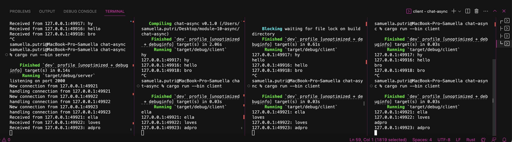
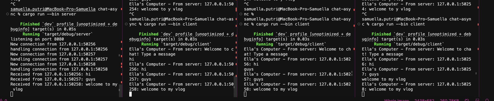

# MODULE 10 BROADCAST ADVPROG - SAMUELLA PUTRI NADIA PAUNTU (2306170446)

## Original code, and how it run

To run this, first start the server using cargo run --bin server, then open three other terminal tabs or windows and run cargo run --bin client in each one to launch the clients. Each client connects to the server via WebSocket on 127.0.0.1:2000. Once connected, every message typed in any client is sent to the server, which then broadcasts it to all clients. The message shown in each client includes the sender's socket address (e.g. 127.0.0.1:49921) followed by the message content. As demonstrated in the screenshot, typing "ella", "loves", and "adpro" from different clients resulted in the messages being received by all other clients and also logged by the server. This confirms that the tokio::select! logic correctly handles both incoming and outgoing streams concurrently, enabling real-time broadcast communication between multiple clients.

## Modifying port
In this experiment, the WebSocket port was successfully changed from 2000 to 8080 without any issues. The modification was done in both the server and client files. In server.rs, the line that binds the TCP listener was updated to "127.0.0.1:8080", and in client.rs, the WebSocket URI was also updated to "ws://127.0.0.1:8080". After making these changes, the server was started, followed by three clients in separate terminals. Each client connected to the server using the new port and was able to send messages. These messages were broadcasted by the server and displayed by all connected clients, showing that communication worked as expected. This confirms that the port change was implemented correctly and that the application can be easily reconfigured to run on different ports.

## Small changes, add IP and Port

In this modification, we added the sender's IP address and port to every message sent from the server to the clients. This was done to give more context to the messages. By using the socket address (SocketAddr) of the client, we can uniquely identify who sent which message. The server formats the broadcasted messages to include this address, and the client prints them clearly with the prefix "From server." As shown in the terminal output, each client receives messages like "From server: 127.0.0.1:50256: hi", which helps differentiate which client sent what. This small change improves clarity and demonstrates a basic but important concept of message traceability in a chat system.